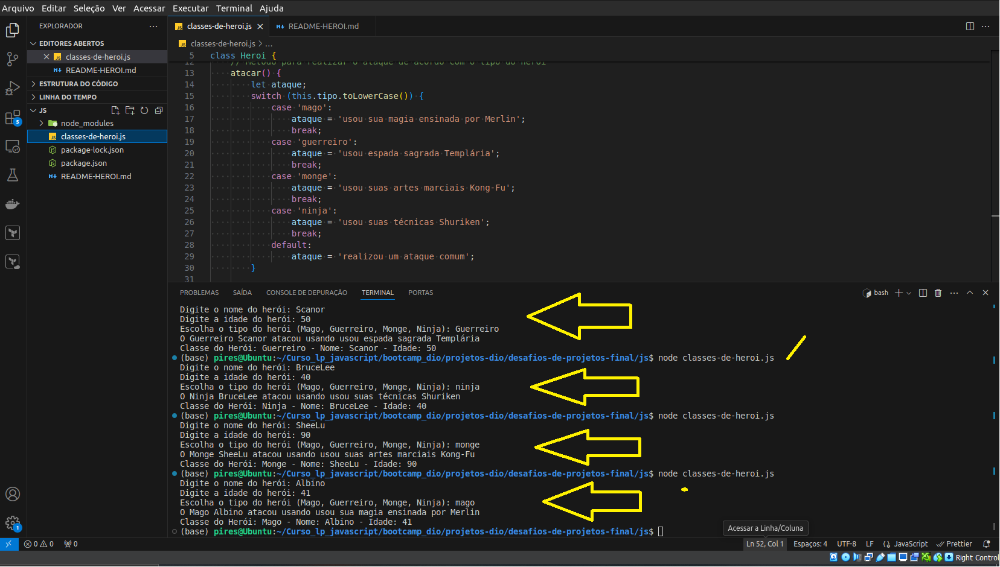

Aqui está o README ajustado conforme as sugestões:

---

# BEM VINDO!

## Informações do Aluno:

**Nome**: Albino Pires  
**LinkedIn**: [Albino Pires](https://www.linkedin.com/in/albino-pires-b188391b3)  
**E-mail**: albinofp34@gmail.com

---

### Linguagens Utilizadas:

- JavaScript


# Projeto: Heroi de Aventura

Este projeto é uma implementação simples de um jogo de aventura onde o usuário pode criar um herói, escolher sua classe e ver o herói realizar ataques personalizados com base em sua classe. O projeto foi feito utilizando JavaScript e requer o uso do pacote `prompt-sync` para capturar a interação do usuário no terminal.

## Funcionalidades:
- O usuário pode escolher o nome, idade e tipo do herói (Mago, Guerreiro, Monge ou Ninja).
- O sistema retorna uma mensagem personalizada de ataque com base no tipo do herói.
- Os ataques são descritos de forma detalhada e temática, proporcionando uma experiência imersiva.

## Exemplo de Saída:
```bash
Digite o nome do herói: Sharpp
Digite a idade do herói: 50
Escolha o tipo do herói (Mago, Guerreiro, Monge, Ninja): mago

O Mago Sharpp atacou usando sua magia ensinada por Merlin
Classe: Mago - Nome: Sharpp - Idade: 50
```

### Outro Exemplo de Saída:
```bash
Digite o nome do herói: Ragnar
Digite a idade do herói: 35
Escolha o tipo do herói (Mago, Guerreiro, Monge, Ninja): guerreiro

O Guerreiro Ragnar atacou usando sua espada sagrada Templária
Classe: Guerreiro - Nome: Ragnar - Idade: 35
```

## Imagem de Funcionamento
Aqui está uma imagem demonstrando o código em execução:


## Requisitos:
- Node.js instalado
- Pacote `prompt-sync` instalado para capturar a interação do usuário no terminal.

### Instalação de Node.js:

#### No Linux (Ubuntu):
1. Atualize os pacotes:
   ```bash
   sudo apt update
   sudo apt install nodejs
   sudo apt install npm
   ```

2. Verifique se o Node.js foi instalado:
   ```bash
   node -v
   ```

#### No Windows:
1. Baixe e instale o Node.js através do [site oficial](https://nodejs.org/).
2. Após a instalação, abra o terminal (Prompt de Comando ou PowerShell) e verifique a instalação:
   ```bash
   node -v
   ```

## Como usar o código:

1. **Clone o repositório**:
   ```bash
   git clone https://github.com/seu-usuario/seu-repositorio.git
   ```

2. **Navegue até o diretório do projeto**:
   ```bash
   cd desafios-de-projetos-final/js
   ```

3. **Instale o pacote `prompt-sync`**:
   No Linux/Windows, execute o seguinte comando para instalar o pacote que captura a interação do usuário:
   ```bash
   npm install prompt-sync
   ```

4. **Execute o código**:
   Após a instalação, execute o código usando o Node.js:
   ```bash
   node testando.js
   ```

## Funcionamento no Windows:

Para rodar o código no Windows, siga os mesmos passos acima (clone do repositório, instalação do Node.js e do `prompt-sync`). O terminal utilizado pode ser o Prompt de Comando ou o PowerShell.

---

## Instruções para entrega
# 3️⃣ Escrevendo as classes de um Jogo

**O Que deve ser utilizado**:

- Variáveis
- Operadores
- Laços de repetição
- Estruturas de decisões
- Funções
- Classes e Objetos

## Objetivo:

Crie uma classe genérica que represente um herói de uma aventura e que possua as seguintes propriedades:

- nome
- idade
- tipo (ex: guerreiro, mago, monge, ninja)

Além disso, deve ter um método chamado **atacar** que deve atender os seguintes requisitos:

- Exibir a mensagem: "o {tipo} atacou usando {ataque}"
- Onde o {tipo} deve ser concatenado ao tipo que está na propriedade da classe
- E no {ataque} deve seguir uma descrição diferente conforme o tipo, seguindo a tabela abaixo:

Se mago -> no ataque exibir (usou magia)  
Se guerreiro -> no ataque exibir (usou espada)  
Se monge -> no ataque exibir (usou artes marciais)  
Se ninja -> no ataque exibir (usou shuriken)

## Saída:

Ao final, deve-se exibir uma mensagem no formato:

- "O {tipo} atacou usando {ataque}"
  Ex: Mago atacou usando magia, Guerreiro atacou usando espada

---
