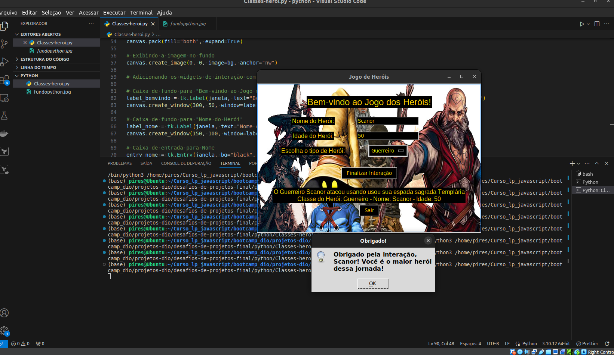

# BEM VINDO!

## Informações do Aluno:

**Nome**: Albino Pires  
**LinkedIn**: [Albino Pires](https://www.linkedin.com/in/albino-pires-b188391b3)  
**E-mail**: albinofp34@gmail.com


# Projeto: Herói de Aventura - Versão em Python

Este projeto é uma implementação de um jogo de aventura utilizando a biblioteca `tkinter` em Python. O usuário pode interagir com a interface gráfica para criar um herói, escolher a classe do herói, e ver o herói realizar ataques personalizados. Ao final, uma mensagem de agradecimento é exibida, indicando que o usuário é o herói dessa jornada.

## Funcionalidades:
- Interface gráfica usando `tkinter`.
- O usuário pode inserir o nome e a idade do herói e escolher uma classe (Mago, Guerreiro, Monge ou Ninja).
- Exibição de ataques personalizados baseados na classe do herói.
- Mensagem de agradecimento ao final da interação.

## Exemplo de Saída:

```bash
Nome do Herói: Albino  
Idade do Herói: 41  
Classe do Herói: Mago  

O Mago Albino atacou usando sua magia ensinada por Merlin.
Obrigado pela interação, Albino! Você é o maior herói dessa jornada!
```

## Imagem de Funcionamento:

Aqui está uma imagem demonstrando o código em execução:



### Linguagens Utilizadas:

- Python

## Estrutura do Projeto:

```
projetos-dio/
    ├── desafios-de-projeto-1/
    ├── desafios-de-projeto-2/
    └── desafios-de-projetos-final/
        ├── js/
        └── python/
```

O projeto está organizado dentro da pasta `desafios-de-projetos-final`, onde a pasta `python` contém todos os arquivos deste projeto.

## Requisitos:
- Python 3.x instalado.
- Biblioteca Pillow para manipulação de imagens.
- Biblioteca tkinter (geralmente já incluída com o Python).

### Instalação da biblioteca Pillow:

Para instalar a biblioteca Pillow, execute:

```bash
pip install Pillow
```

## Como usar o código:

1. **Clone o repositório**:
   ```bash
   git clone https://github.com/seu-usuario/seu-repositorio.git
   ```

2. **Navegue até o diretório do projeto**:
   ```bash
   cd desafios-de-projetos-final/python
   ```

3. **Execute o código**:
   No terminal, execute o seguinte comando para rodar a interface gráfica:
   ```bash
   python3 heroi_de_aventura.py
   ```

---

## Instruções para entrega:

### O Que deve ser utilizado:
- Variáveis
- Operadores
- Estruturas de decisão
- Funções
- Classes e objetos
- Interface gráfica com tkinter

### Objetivo:

Crie um jogo de aventura onde o usuário interage com a interface gráfica para inserir os dados do herói (nome, idade, tipo). O programa deve calcular e exibir o ataque realizado pelo herói com base na classe escolhida.

## Saída Esperada:

Ao final da interação, deve ser exibida uma mensagem com o nome, a classe do herói e o ataque realizado, e uma mensagem de agradecimento ao usuário.

---
